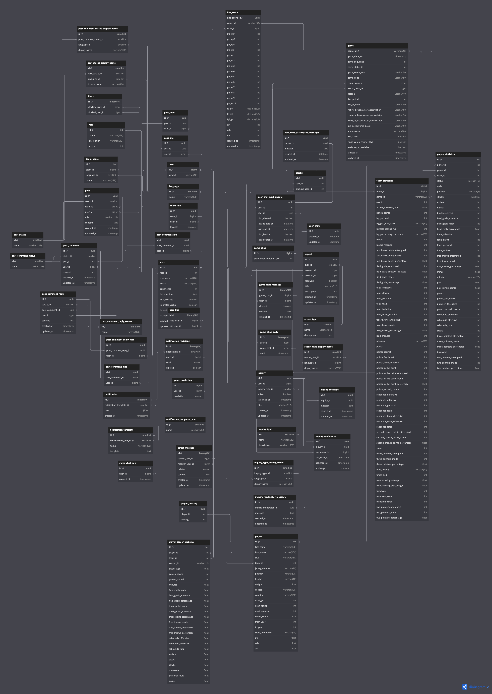

# Basket Lounge (Backend)

## Introduction
- A community where you can share and communicate about basketball (especially NBA). Fans can freely share information about basketball and talk about basketball.
- This repository contains only the backend part of the project. You can check the frontend part [here](https://github.com/7jw92nVd1kLaq1/bl-frontend).
- Anyone interested in expanding one's knowledge of Django, Django REST framework, Celery, and other technologies can contribute to this project. If you have any questions or suggestions, please feel free to leave an issue.

## Features
- NBA Information
  - NBA Team Information
    - You can check the team logo, team name, team nickname, team establishment year, team headquarters, team home stadium, and team introduction.
  - NBA Player Information
    - You can check the player's general information and game records.
  - NBA Game Information
    - You can check the game date, game time, home team, away team, game result, and game score.
- Real-time Game Information
  - NBA Game Schedule
    - You can check the game date, game time, home team, and away team.
    - You can filter by date.
  - NBA Game Result
    - You can check the game date, home team, away team, and game result.
  - NBA Team Ranking
    - You can check the team ranking, team logo, team name, team win count, and team loss count.
  - Real-time Chat
    - You can chat in real-time about the game.
- Community
  - Bulletin Board
    - Post, edit, and delete posts
      - You can check the post title, post content, post author, post creation time, and post like count.
      - You can like the post.
    - Comment
      - You can check the comment content, comment author, and comment creation time.
      - You can write a comment.
    - Post Search
      - You can filter by various criteria and search by title and content.
  - User Information
    - Other User Information
      - You can check the introduction and like count of other users.
      - You can check the profile of other users.
      - You can check the posts and comments of other users.
  - Sign Up, Sign In, Sign Out
    - You can sign up using only social login.
    - You can use an authentication/authorization system using JWT tokens.
  - Administrator
    - The administrator can check all user information.
    - The administrator can check all posts and comments.
    - The administrator can modify the information of general users.
    - The administrator can delete the posts and comments of general users.

## Future Features
- Notification Function
  - Users can receive notifications when they receive likes or comments.
- More Basketball Information
  - Provide information on leagues other than the NBA.
- More Bulletin Board Functions
  - You can attach images to posts.
  - You can add hashtags to posts.
- **Feel free to suggest more features!**

## [DB Schema](https://dbdiagram.io/d/66d810a8eef7e08f0ea2a34e)

## API Documentation
- The API documentation is not available yet.

## Contribution
- If you want to contribute to this project, please refer to the [CONTRIBUTING.md](CONTRIBUTING.md) file.

## License
- This project is licensed under the MIT License. For more information, please refer to the [LICENSE](LICENSE) file.

## Contact
- If you have any questions or suggestions, please feel free to leave an issue.